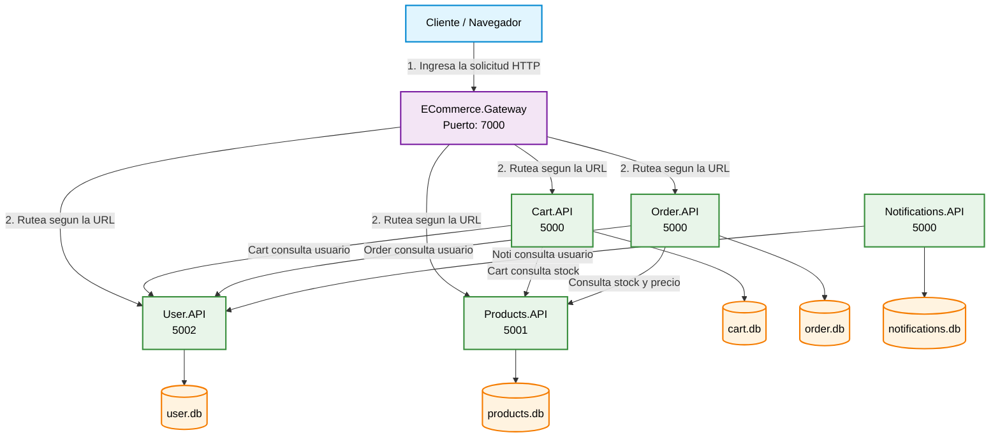

    
    USERS.API SCREENSHOTS

Registro exitoso

Error 400 - USR-002

Error 409 - USR-001 -  Mail ya registrado

Error 401 - USR-003 - Login con clave incorrecta

Error 403 - USR-004 - Superar intentos máximos

ORDERS.API SCREENSHOTS

Falla de Integración HTTP - Stock Insuficiente (ORD-005) 

Products.API ScreenShots

