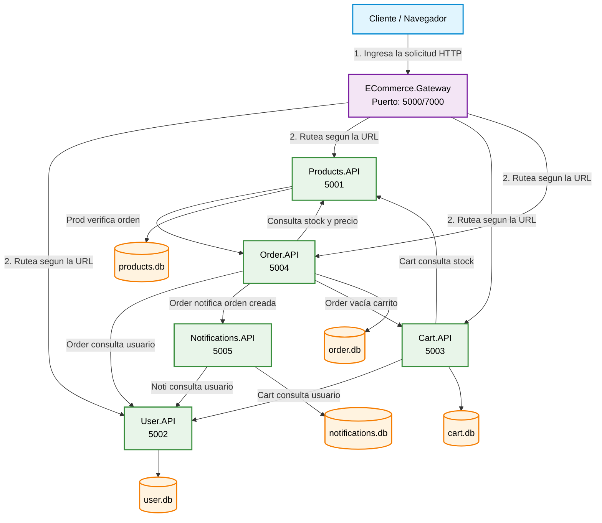

# Sistema de E-Commerce - Microservicios (Grupo 6)

Trabajo Práctico desarrollado para Construcción de Aplicaciones Informáticas en el primer cuatrimestre de 2026. 
E-Commerce con una arquitectura orientada a microservicios utilizando .NET 9, SQLite para una DB independiente por servicio, logging, trazabilidad de peticiones, Health Checks, y un API gateway. 
Integrado con Swagger. Ofrece un manejo estandarizado de excepciones detalladas en las consignas del trabajo práctico y ejemplificadas en el mismo README.

---

## Integrantes
* **Leandro Salzberg**: Order.API, Cart.API
* **Santiago Ubeid**: User.API, Notifications.API
* **Mariano Fioretti**: ECommerce.Gateway, ECommerce.Shared, Products.API.

---

## Requisitos Previos y Configuración
Herramientas:
* SDK de .NET 9.0 o superior
* Visual Studio 2022 o VS Code
* Herramienta o Visor de SQLite (opcional, para auditar los archivos `.db`)

### Configuración del Inicio Múltiple en Visual Studio
**Para ejecutar el flujo completo del backend en paralelo**

**Para empezar, hay que clonar el repositorio utilizando git clone https://github.com/s6ntiu/e-CommerceG6"**

En la barra de tareas:

Desplegamos el menú entre el botón verde Start y el TestNotiplusUser y seleccionamos en configurar Startup Projects

Una vez en el menú creamos uno nuevo y seleccionamos Start en todas menos ECommerce.shared

**Una vez tenemos este perfil, lo guardamos tocando aplicar y lo iniciamos utilizando el boton de Start en la barra de herramientas, o utilizamos el siguiente comando en una terminal de powershell**

**dotnet run --launch-profile "Nombre_Perfil"**

---

### Endpoints Principales y Puertos Locales

| Servicio | Swagger UI | Health Check |
| :--- | :--- | :--- |
| **Users API** | [http://localhost:5002/swagger](http://localhost:5002/swagger) | [http://localhost:5002/health](http://localhost:5002/health) |
| **Products API** | [http://localhost:5001/swagger](http://localhost:5001/swagger) | [http://localhost:5001/health](http://localhost:5001/health) |
| **Cart API** | [http://localhost:5003/swagger](http://localhost:5003/swagger) | [http://localhost:5003/health](http://localhost:5003/health) |
| **Orders API** | [http://localhost:5004/swagger](http://localhost:5004/swagger) | [http://localhost:5004/health](http://localhost:5004/health) |
| **Notifications API** | [http://localhost:5005/swagger](http://localhost:5005/swagger) | [http://localhost:5005/health](http://localhost:5005/health) |

---
## Diagrama de arquitectura del proyecto

    
### USERS.API SCREENSHOTS

Registro exitoso

Error 400 - USR-002

Error 409 - USR-001 -  Mail ya registrado

Error 401 - USR-003 - Login con clave incorrecta

Error 403 - USR-004 - Superar intentos máximos

### ORDERS.API SCREENSHOTS

Falla de Integración HTTP - Stock Insuficiente (ORD-005) 

Transición de Estado Inválida (ORD-006)

### Products.API ScreenShots

Producto Duplicado (PRD-003)

### Cart.Api ScreenShots

Cantidad Inválida en Carrito (CRT-004)

